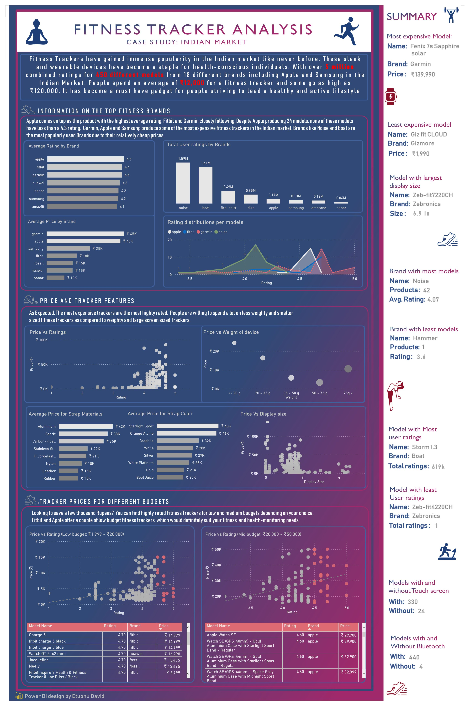

# Fitness Tracker Analysis (Indian Market)

## Introduction
This is an analysis on the different fitness tracker devices made by different brands in the Indian Market

## Skills demonstrated
- DAX
- Filters and Slicers
- PowerPoint Presentation
- Storytelling

## Problem Statement
- Information on some of the top brands in the indian market
- The relationship between the Price of the fitness tracker and their different features
- Segmenting the fitness trackers into categories by price for different users

## Data Sourcing
This consist of a single csv file consisting of 16 columns and 450 rows

## Analysis and Visualization.
This is the image of the Dashboard made

